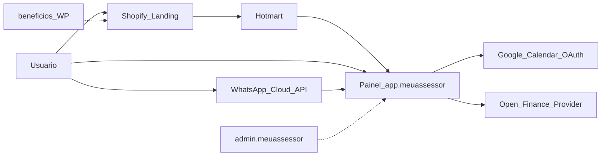

# 01 — Mapa do ecossistema (Meu Assessor)

Fonte: Firecrawl map (21/07/2026) + análise pública + relatório ChatGPT cruzado.

## Superfícies

| URL | Função | Tecnologia aparente | Notas |
|-----|--------|---------------------|-------|
| `https://meuassessor.com` | Site comercial | Shopify (IP típico 23.227.38.65) | Landing + pricing + FAQ |
| `https://app.meuassessor.com` | Painel do cliente | Nginx / Ubuntu | Login + cadastro |
| `https://app.meuassessor.com/cadastro` | Onboarding | SPA/web app | E-mail Hotmart, WhatsApp, preferências |
| `https://admin.meuassessor.com` | Admin interno | Portal login público | Superfície sensível — não testar |
| `https://beneficios.meuassessor.com` | B2B benefícios | WordPress | Indexado `hello-world` — abandono aparente |
| Páginas `/agenda/compartilhada/...` | Agendamento | Links públicos indexados | Risco de exposição comercial |
| Hotmart | Cobrança | Checkout externo | Cancelamento via Hotmart (termos) |
| WhatsApp Business Cloud API | Canal principal | Meta | Confirmado na política de privacidade |

## Colisão de marca — app das lojas

| Item | Site meuassessor.com | App lojas |
|------|----------------------|-----------|
| Nome | Meu Assessor | Meu Assessor IA |
| Publisher | Tittanium INC / JMM Company (CNPJ citado em bases) | APPS STARS DESENVOLVEDORES LTDA |
| Package Android | N/A (sem app oficial) | `com.appstarsbiblia.meuassessor` |
| Canal | WhatsApp + web | App nativo + anúncios + IAP |
| Preço | ~R$ 29,90/mês (promo anual) | Mensal/anual bem mais altos (IAP) |
| Privacidade | meuassessor.com | appstarsbiblia.com |
| Stack IA citada | Não detalhada publicamente | Ollama + Groq fallback, Firebase, AdMob, RevenueCat |

**Conclusão:** produtos **independentes**. Site afirma explicitamente que **não precisa instalar app**.

## Identidade jurídica (riscos observados)

Referências públicas conflitantes:

- “Tittanium INC” / Felipe Titto (marketing)
- “Meu Assessor LTDA”
- CNPJ 54.302.560/0001-20 associado em agregadores a **JMM COMPANY LTDA** (Florianópolis)
- Foro nos termos: Balneário Camboriú/SC
- Cobrança: Hotmart

Inova Hub deve evitar esse padrão: uma razão social, um DPO, um controlador claro.

## DNS / e-mail (sinais públicos)

- DNS: padrão Hostinger (relato ChatGPT)
- E-mail: Google Workspace
- Cloudflare em parte da superfície
- App: HSTS, X-Frame-Options DENY (relato jun/2026)

## Diagrama

