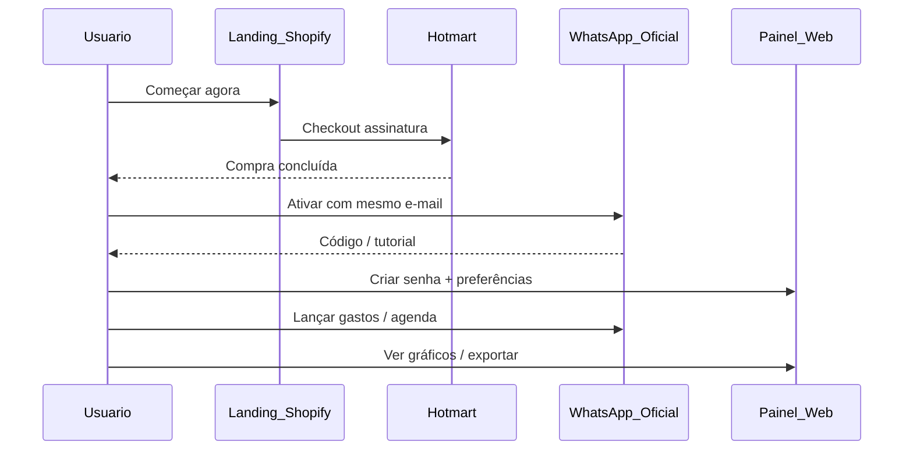

# 03 — Jornadas de usuário

## Concorrente (Meu Assessor) — fluxo observado

### Passos de cadastro (página pública)

1. Nome, e-mail da compra Hotmart, telefone  
2. Senha do painel  
3. Moeda, idioma, fuso  
4. Enviar código único no WhatsApp  
5. Trial mencionado em telas (“3 dias” / pagamento em processamento)

### Operação diária

1. Usuário manda áudio/texto no WhatsApp  
2. IA interpreta → cria lançamento / compromisso / tarefa / arquivo  
3. Usuário consulta pelo Zap ou abre o painel  

## Inova Hub / Finova — jornadas alvo

### B2C (Fase A)

1. Landing Inova Hub → trial sem Hotmart obrigatório  
2. Vincular WhatsApp à **Finova** (OTP)  
3. Onboarding guiado (3 intenções: gasto, compromisso, consulta)  
4. Opcional: conectar banco (Open Finance) e Google Agenda  
5. Uso diário via Finova; análise no Hub  
6. Cancelar / exportar / excluir **no painel**

### B2B Benefícios (Fase B)

1. RH cria empresa no Inova Hub  
2. Upload CSV de telefones  
3. Finova ativa colaboradores  
4. RH vê adoção agregada (sem ver lançamentos pessoais, por padrão)  
5. Relatório mensal de engajamento  

### Vertical (Fase C)

1. Escolher pack (ex.: clínica, corretor, profissional liberal)  
2. Categorias + intents Finova pré-carregados  
3. Templates de cobrança / agenda de clientes  

## Papéis

| Papel | Finova (WA) | Inova Hub |
|-------|-------------|-----------|
| Titular | Sim | Admin conta |
| Membro compartilhado | Sim (lança) | Limitado |
| Viewer | Consulta | Só leitura |
| RH (B2B) | Não (ou bot separado) | Portal empresa |
| Admin Inova (interno) | — | Backoffice restrito |
