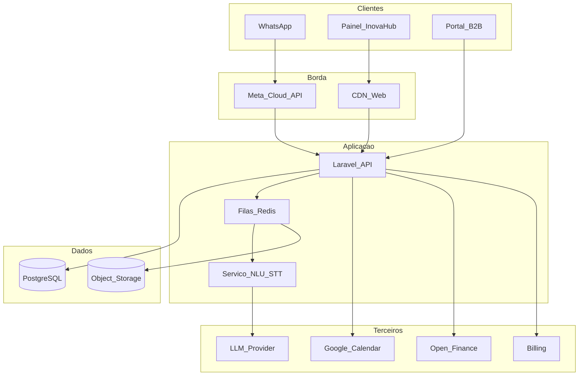

# 10 — Arquitetura Inova Hub / Finova

> **System Design completo (fonte canônica):** [20-system-design.md](20-system-design.md)

## Visão lógica

## Stack recomendada

| Camada | Tecnologia |
|--------|------------|
| API / Web | Laravel 11+ (API + Inertia/Blade ou SPA separada) |
| DB | PostgreSQL |
| Fila | Redis + Horizon |
| WhatsApp | Meta Cloud API webhooks |
| Frontend painel | React/Vue ou Livewire (decidir no Spec Kit) |
| Auth | Sanctum/Passport + OTP WhatsApp |
| Storage | Cloudflare R2 |
| Billing | Asaas via `BillingGateway` (Stripe só P1) |
| Open Finance | Pluggy via `OpenFinanceProvider` |
| Deploy | Docker Compose na VPS Hetzner + Cloudflare |

## Domínios de dados (MVP)

- `users`, `organizations`, `memberships`  
- `whatsapp_identities`  
- `transactions`, `categories`  
- `events`, `reminders`  
- `tasks`, `projects`  
- `oauth_tokens` (Google) encrypted  
- `subscriptions`, `audit_logs`  
- `message_logs` (retenção curta)  
- `of_items`, `of_accounts`, `of_transactions` (Pluggy)  

## Pipeline Finova (mensagem)

1. Webhook Meta → valida assinatura  
2. Idempotência por `wamid`  
3. Se áudio → STT  
4. NLU → intent + entities  
5. Executa use-case (com confirmação se confiança baixa)  
6. Persiste + responde WhatsApp  
7. Atualiza Hub em tempo quase real  

## Segurança

- Tenant isolation em todas as queries  
- Admin interno fora da internet pública  
- Secrets rotacionáveis  
- Rate limit por telefone/usuário  
- Prompt injection: tools com allowlist; sem SQL livre da LLM  

## Open Finance (P0 — MVP)

Adapter `OpenFinanceProvider` → **Pluggy** (somente leitura).  
Consentimento versionado; sync assíncrono via webhooks/jobs; nunca armazenar senha bancária; revogação apaga dados OF do tenant.  
Iniciador de pagamento / Pix saída = pós-MVP.
