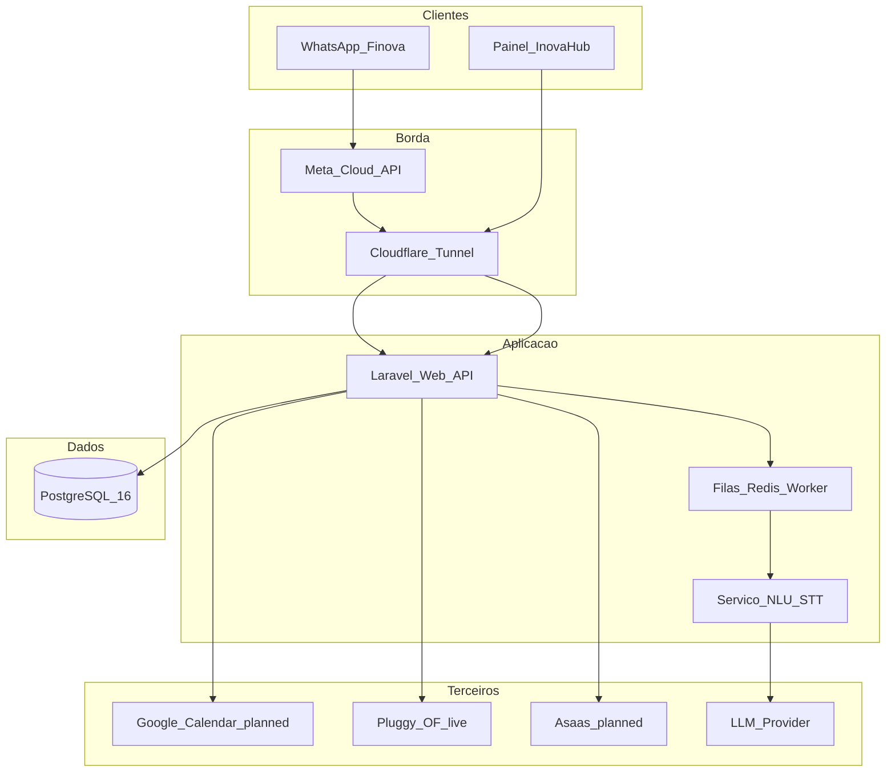

# 10 — Arquitetura Inova Hub / Finova

> **System Design completo (fonte canônica):** [20-system-design.md](20-system-design.md) **v1.2**  
> **Estado vivo:** [25-project-state.md](25-project-state.md)

## Visão lógica

Portal B2B / RH e object storage (R2) ficam fora do diagrama MVP ativo — ver fases B/P1 em [20](20-system-design.md).

## Stack (MVP travado)

| Camada | Tecnologia |
|--------|------------|
| API / Web | PHP 8.4 + Laravel 13 + **Blade** |
| DB | PostgreSQL 16 + RLS |
| Fila | Redis 7 + queue worker (Horizon opcional depois) |
| WhatsApp | Meta Cloud API webhooks |
| Frontend painel | Blade Hub (SPA só se necessário pós-MVP) |
| Auth | Sanctum + sessão Hub + OTP WhatsApp |
| Storage | Cloudflare R2 (planned) |
| Billing | Asaas via `BillingGateway` (planned; Stripe = P1) |
| Open Finance | Pluggy via `OpenFinanceProvider` (**live**, somente leitura) |
| Deploy | Docker Compose VPS + Cloudflare Tunnel → `127.0.0.1:8088` |

## Domínios de dados

**Live:** `users`, `organizations`, `memberships`, `whatsapp_identities`, `transactions`, `categories`, `of_items`, `of_accounts`, `of_transactions`, `consent_logs`, `webhook_events`

**Planned:** `events`, `reminders`, `tasks`, `projects`, `oauth_tokens`, `subscriptions`, `audit_logs`

## Pipeline Finova (mensagem)

1. Webhook Meta → valida assinatura  
2. Idempotência por `wamid` (`webhook_events`)  
3. Se áudio → STT  
4. NLU → intent + entities  
5. Executa use-case (com confirmação se confiança baixa)  
6. Persiste + responde WhatsApp  
7. Hub reflete os mesmos dados (quase real-time via DB)

Intents live hoje: `tx.*`, `bank.balance` / `bank.statement` / `bank.cards`. Agenda/tarefa = D29+.

## Segurança

- Tenant isolation em todas as queries (scope + policy + RLS + Pest IDOR)  
- Admin interno fora da internet pública  
- Secrets rotacionáveis (nunca no git)  
- Rate limit por telefone/usuário  
- Prompt injection: tools com allowlist; sem SQL livre da LLM  

## Open Finance (P0 — live Semana 4)

Adapter `OpenFinanceProvider` → **Pluggy** (somente leitura, BR-005).  
Consentimento versionado (`of-1.0` + `consent_logs`); sync assíncrono via webhooks/jobs; categorização sugerida; revogação apaga dados OF (BR-006).  
Iniciador de pagamento / Pix saída = pós-MVP.
