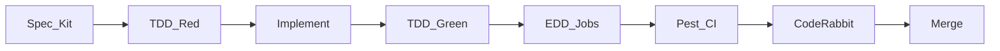

# 18 — Squads de agentes de IA

Dois squads permanentes. Invocar pelos papéis abaixo no Cursor (e depois em CI/PR).

## Squad A — Construção, correção, validação e testes

**Missão:** entregar features do MVP com SDD+TDD+EDD, corrigir falhas e validar qualidade antes do merge.

| Papel | Comando sugerido | Responsabilidade |
|-------|------------------|------------------|
| Pesquisador | `/pesquisador` | Snirf, APIs externas, docs Pluggy/Meta/Asaas |
| Roteirista | `/roteirista` | Spec Kit: `spec.md` + critérios de aceite |
| Estrutural | `/estrutural` | Arquitetura, migrations, eventos, contratos |
| Orquestrador | `/orquestrador` | Quebra em tasks; ordem Dxx do calendário |
| Implementador | `/implementador` | Código Laravel; TDD Red-Green |
| Testador | `/testador` | Pest, eval Finova, IDOR, webhooks |
| Validador | `/validador` | Lint, CI, CodeRabbit findings, LGPD |
| Finalizador | `/finalizador` | PR, checklist DoD, atualiza docs |

### Pipeline do Squad A (por feature)

### Definition of Done (Squad A)

- [ ] Spec aprovada (ou task do `15-day-by-day`)  
- [ ] Testes Pest cobrindo regra de negócio  
- [ ] Sem secrets no diff  
- [ ] Tenant isolation verificado se toca dados  
- [ ] Docs/business-rules atualizadas se regra mudou  
- [ ] CodeRabbit sem blocker aberto  

---

## Squad B — Pós-finalização (operações e tarefas de usuários)

**Missão:** depois do soft launch / entrega de épico, cuidar de suporte, incidentes, SRE e melhoria contínua das tarefas reais dos usuários.

| Papel | Comando sugerido | Responsabilidade |
|-------|------------------|------------------|
| Suporte | `/suporte` | Triagem tickets, playbooks, respostas Finova/Hub |
| Incidente | `/incidente` | Severidade, mitigação, postmortem |
| SRE | `/sre` | Uptime, filas Redis, disco VPS, backups |
| Produto | `/produto` | Priorizar feedback beta → backlog |
| Dados/LGPD | `/lgpd` | Export, delete, consentimento OF |
| QA regressão | `/qa-pos` | Smoke pós-deploy; eval Finova |

### Gatilhos Squad B

- Deploy produção  
- Alerta `/up` down  
- Webhook Meta/Pluggy/Asaas falhando  
- Pedido de exclusão LGPD  
- Bug reportado por usuário beta  

### Handoff A → B

Quando D56 (soft launch) ou um épico fecha:

1. Squad A entrega runbook + DoD  
2. Squad B assume monitoramento e fila de tarefas de usuário  
3. Bugs P0 voltam ao Squad A com spec mínima  

---

## CodeRabbit

- Arquivo: [`.coderabbit.yaml`](../.coderabbit.yaml)  
- Ativar app CodeRabbit no GitHub do repo  
- Reviews focados em: segurança, tenant isolation, webhooks, testes ausentes  

## Regras de negócio

Fonte canônica: [`docs/business-rules/`](business-rules/)  
Toda regra nova = teste Pest + entrada no catálogo BR-xxx.
