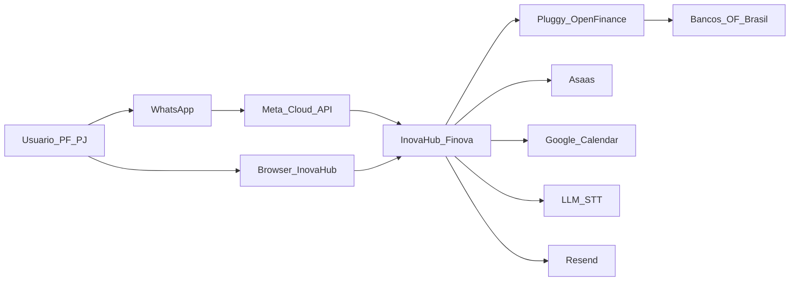
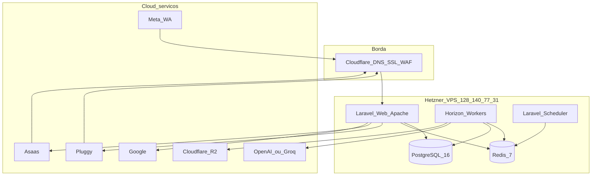
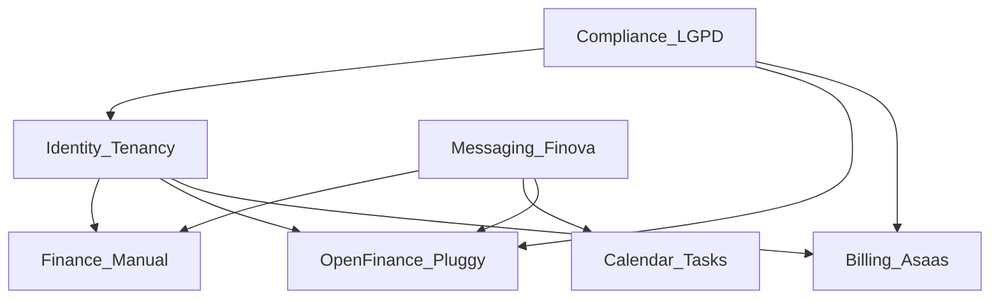
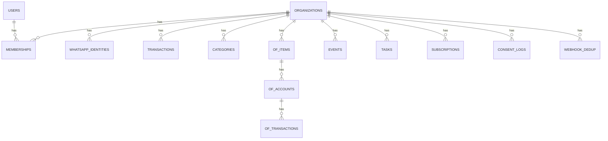
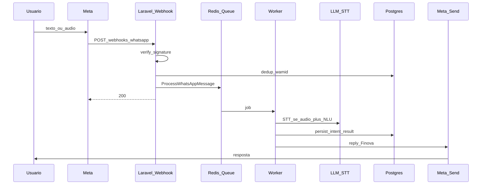
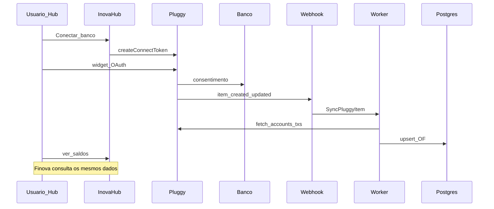
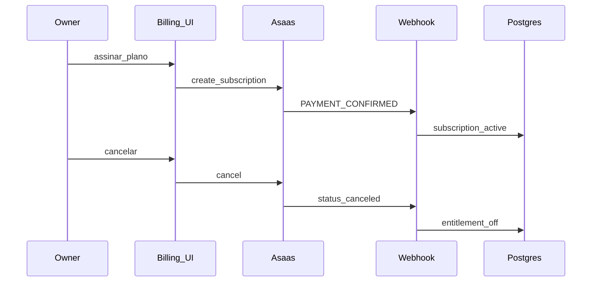

# 20 — System Design completo — Inova Hub / Finova

**Versão:** 1.1  
**Data:** 22/07/2026  
**Status:** Baseline MVP (Fase A) + UI responsiva + multi-tenant + segurança em camadas  
**Domínio:** `inovahub.inovatitech.com.br` · API `api-inovahub.inovatitech.com.br`  
**VPS:** `128.140.77.31` (Hetzner) · DNS/SSL: Cloudflare  

Documentos relacionados: [PRD](09-inova-hub-prd.md) · [Arquitetura](10-architecture.md) · [Segurança L1–L11](21-security-layers.md) · [UI responsiva](22-responsive-ui.md) · [DB multi-tenant](23-multitenant-database.md) · [Regras BR-xxx](business-rules/README.md) · [Dia a dia](15-day-by-day-mvp.md)

---

## 1. Contexto e objetivos

### 1.1 Problema

Pessoas e pequenas equipes precisam organizar **dinheiro, agenda e tarefas** sem planilha e sem app nativo. O canal natural é o WhatsApp; o painel web serve para análise, conexões bancárias e administração.

### 1.2 Solução

| Camada | Nome | Função |
|--------|------|--------|
| Assistente conversacional | **Finova** | WhatsApp (texto/áudio): lançar, consultar, agendar, tarefas, saldo/extrato |
| Plataforma | **Inova Hub** | Auth, dashboard, OF Connect, Google, billing Asaas, membros, LGPD |

### 1.3 Objetivos de design

1. **UI 100% responsiva** (landing + Hub) — ver [22-responsive-ui.md](22-responsive-ui.md)  
2. **Banco multi-tenant** (`organization_id` + RLS) — ver [23-multitenant-database.md](23-multitenant-database.md)  
3. **Segurança em 11 camadas** (borda → ops) — ver [21-security-layers.md](21-security-layers.md)  
4. Event-driven para webhooks (Meta, Pluggy, Asaas)  
5. Open Finance somente leitura via Pluggy  
6. Billing self-service (Asaas) — cancel/export/delete  
7. Spec/TDD/EDD + CodeRabbit + squads A/B  

### 1.4 Fora do MVP (system design reserva slots)

- Stripe, Drive semântico completo, Meet/atas, B2B RH, verticais, iniciador de pagamento Pix  

---

## 2. Visão de alto nível (C4 — contexto)

---

## 3. Contêineres (C4)

### 3.1 Responsabilidades

| Contêiner | Responsabilidade |
|-----------|------------------|
| Laravel Web | HTTP API, painel, webhooks (validação + enqueue) |
| Horizon Workers | Jobs: NLU, STT, sync OF, lembretes, e-mails, exports |
| Scheduler | Sync OF periódico, lembretes, limpeza |
| PostgreSQL | Fonte da verdade multi-tenant |
| Redis | Filas, cache, sessões |
| Cloudflare | DNS, TLS, proxy, (R2 depois) |

---

## 4. Stack tecnológica (decisões fechadas)

| Camada | Escolha | Notas |
|--------|---------|-------|
| Runtime | PHP 8.4 + Laravel 13 | Já no skeleton `app/` |
| DB | **PostgreSQL 16** | UUID, JSONB, tenant |
| Fila/cache | Redis 7 + Horizon | EDD |
| Auth | Sanctum + OTP WhatsApp | |
| Frontend MVP | Blade/Inertia ou Livewire | Spec Kit pode fechar SPA depois |
| WA | Meta Cloud API | Finova |
| OF | **Pluggy** | Somente leitura |
| Billing | **Asaas** | Stripe = P1 |
| Agenda | Google Calendar OAuth | Escopos mínimos |
| IA | LLM + Whisper | NLU + áudio |
| E-mail | Resend | |
| Deploy | Docker Compose na VPS | |
| Edge | Cloudflare | `inovahub` + `api-inovahub` (+ Tunnel) |

---

## 5. Domínios de negócio (bounded contexts)

| Contexto | Capacidades | Regras |
|----------|-------------|--------|
| Identity / Tenancy | users, orgs, memberships, papéis | BR-001, BR-009 |
| Messaging / Finova | webhook WA, intents, respostas | BR-002, BR-004, BR-010 |
| Finance manual | transactions, categories | BR-003, BR-004 |
| Open Finance | connect, accounts, cards, sync | BR-005, BR-006 |
| Calendar / Tasks | events, reminders, tasks | — |
| Billing | trial, subscribe, cancel | BR-007 |
| Compliance | export, delete, consent | BR-006, BR-008 |

---

## 6. Modelo de dados (lógico)

### 6.1 Entidades principais

### 6.2 Tabelas (MVP)

| Tabela | Campos-chave |
|--------|----------------|
| `organizations` | id (uuid), name, timezone, locale, currency |
| `users` | id, email, password_hash |
| `memberships` | org_id, user_id, role (`owner`/`member`/`viewer`) |
| `whatsapp_identities` | org_id, user_id, phone_e164, verified_at |
| `categories` | org_id, name, kind |
| `transactions` | org_id, amount_cents, type, category_id, source (`manual`/`finova`/`of`), occurred_at |
| `of_items` | org_id, pluggy_item_id, status, consent_version |
| `of_accounts` | item_id, balance, type, name |
| `of_transactions` | account_id, amount, date, description, category_suggested |
| `events` | org_id, title, starts_at, google_event_id nullable |
| `reminders` | event_id, notify_at, sent_at |
| `tasks` | org_id, title, due_at, status |
| `oauth_tokens` | org_id, provider, encrypted payload |
| `subscriptions` | org_id, asaas_id, plan, status |
| `webhook_dedup` | provider, external_id, processed_at |
| `consent_logs` | org_id, type, version, accepted_at |
| `audit_logs` | org_id, actor_id, action, meta jsonb |

**Convenção:** toda query de negócio filtra `organization_id` (BR-001).  
**Detalhe completo multi-tenant + RLS:** [23-multitenant-database.md](23-multitenant-database.md).

---

## 6.1 Frontend responsivo (obrigatório)

Landing e painel Inova Hub são **100% responsivos** (mobile-first).  
Breakpoints, componentes, DoD de viewport e anti-padrões: [22-responsive-ui.md](22-responsive-ui.md).

Requisitos resumidos:

- Viewport meta correto; sem overflow-x de layout  
- Tabelas → cards no mobile  
- Nav: drawer/bottom no mobile; sidebar no desktop  
- Touch targets ≥ 44px; formulários 1 coluna no mobile  
- Testar 360 / 768 / 1280 antes do merge de UI  

---

## 7. Arquitetura de eventos (EDD)

### 7.1 Princípio

Controllers de webhook: **validar assinatura → dedup → dispatch Job → 200 rápido**.  
Lógica de negócio nos Jobs/Handlers.

### 7.2 Fluxo mensagem WhatsApp

### 7.3 Fluxo Open Finance (Pluggy)

### 7.4 Fluxo billing (Asaas)

### 7.5 Catálogo de jobs (MVP)

| Job | Trigger | Efeito |
|-----|---------|--------|
| `ProcessWhatsAppMessage` | webhook Meta | NLU + side-effects + reply |
| `TranscribeAudio` | mídia WA | STT → texto |
| `SyncPluggyItem` | webhook / schedule | contas + txs |
| `CategorizeOfTransaction` | sync OF | categoria IA |
| `SendReminder` | scheduler | mensagem WA |
| `ExportOrgData` | user request | ZIP/CSV |
| `DeleteOrganization` | user confirm | cascade + revoke |
| `ProcessAsaasWebhook` | Asaas | entitlement |

---

## 8. API e superfícies HTTP

### 8.1 Hosts

| Host | Uso |
|------|-----|
| `https://inovahub.inovatitech.com.br` | Landing + painel |
| `https://api-inovahub.inovatitech.com.br` | API + webhooks |

### 8.2 Webhooks (ingress)

| Método | Path | Auth |
|--------|------|------|
| GET/POST | `/webhooks/whatsapp` | Meta verify + signature |
| POST | `/webhooks/pluggy` | secret/header Pluggy |
| POST | `/webhooks/asaas` | token Asaas |

### 8.3 API autenticada (prefixo `/v1`)

| Área | Exemplos |
|------|----------|
| Auth | `POST /auth/register`, `/login`, `/whatsapp/otp` |
| Finance | `GET/POST /transactions`, `GET /categories` |
| OF | `POST /open-finance/connect-token`, `GET /open-finance/accounts`, `DELETE /open-finance/items/{id}` |
| Calendar | `GET/POST /events`, `POST /google/connect` |
| Tasks | `GET/POST /tasks` |
| Members | `GET/POST /members` |
| Billing | `GET /billing`, `POST /billing/subscribe`, `POST /billing/cancel` |
| LGPD | `POST /exports`, `DELETE /account` |

Contrato OpenAPI formal: gerar na implementação (D08+). Inventário vivo: [05-api-surface.md](05-api-surface.md).

### 8.4 Finova — intents (contrato conversacional)

| Intent | Entrada | Saída |
|--------|---------|-------|
| `tx.create` / `tx.income` | NL | lançamento (+ confirmação se low confidence) |
| `tx.query` | período/categoria | resumo |
| `bank.balance` / `bank.statement` / `bank.cards` | OF conectado | saldos/extrato |
| `event.create` / `event.query` | NL | agenda |
| `task.create` | NL | tarefa |
| `help` / `support` | — | menu / handoff |

---

## 9. Segurança

**Documento canônico das camadas L1–L11:** [21-security-layers.md](21-security-layers.md).

### 9.1 Resumo das camadas

| Camada | Foco |
|--------|------|
| L1 | Cloudflare WAF / TLS / DDoS |
| L2 | Firewall VPS / SSH / Docker |
| L3 | HTTPS, cookies Secure/HttpOnly |
| L4 | CSRF, XSS, validação, headers, rate limit |
| L5 | AuthN/AuthZ, papéis, OTP |
| L6 | Multi-tenant app (scopes/policies) |
| L7 | Postgres crypto, backups, **RLS** |
| L8 | Webhooks assinados + idempotência |
| L9 | Pluggy/Asaas/Google/LLM least privilege |
| L10 | LGPD export/delete/consent/audit |
| L11 | Secrets, CI, monitoramento, incidentes |

### 9.2 Controles críticos MVP

| Controle | Design |
|----------|--------|
| Tenant isolation | Scope + policy + RLS + testes IDOR (BR-001) |
| Webhook auth | Assinaturas/secrets; rejeitar inválidos |
| Idempotência | `webhook_dedup` (BR-010) |
| Secrets | `.env` / vault VPS; nunca no git |
| Tokens OAuth | Encrypted at rest |
| Admin interno | **Não** expor na internet pública |
| Rate limit | Por IP e por `phone_e164` |
| LGPD | Consent OF; export/delete (BR-008) |
| Prompt injection | Tools allowlist; sem SQL livre da LLM |

### 9.3 Dados sensíveis

- Não logar corpo completo de mensagens em produção (PII)  
- Áudio: processar e descartar (retenção mínima)  
- OF: nunca senha bancária; só tokens Pluggy  

### 9.4 Comunicação

- TLS na borda (Cloudflare Full strict)  
- **Não** comercializar como “E2E” genérico: distinguir trânsito vs processamento IA  

---

## 10. Infraestrutura e deploy

### 10.1 Topologia produção

| Item | Valor |
|------|-------|
| DNS | Cloudflare zona `inovatitech.com.br` |
| DNS / Tunnel | `inovahub` + `api-inovahub` → Tunnel (ou A + Origin Rule) |
| VPS | Hetzner, Docker Compose |
| Serviços | `app`, `worker` (horizon), `scheduler`, `postgres`, `redis` |
| SSL | Cloudflare + cert origem / Caddy |

### 10.2 Ambientes

| Env | Uso |
|-----|-----|
| local | Docker Desktop (portas 8092/5442/6392) |
| staging | subdomínio opcional na mesma VPS ou segunda |
| production | hosts acima |

### 10.3 CI/CD

- GitHub Actions: Composer + Pest + Pint (`.github/workflows/ci.yml`)  
- CodeRabbit em PRs (`.coderabbit.yaml`)  
- Deploy: SSH + `docker compose pull/up` (pipeline a endurecer na semana 8)  

### 10.4 Backups

- Snapshot Hetzner semanal  
- `pg_dump` diário + restore drill (D47)  

---

## 11. Qualidade e engenharia

| Prática | Como |
|---------|------|
| SDD | Spec Kit / Dxx antes de feature |
| TDD | Pest Red→Green para BR-xxx |
| EDD | Webhooks → Jobs |
| CodeRabbit | Review automático |
| Squad A | Build / teste / validação |
| Squad B | Pós-launch / suporte / SRE |

Definition of Done: ver [18-agent-squads.md](18-agent-squads.md).

---

## 12. NFRs (não funcionais)

| NFR | Alvo MVP |
|-----|----------|
| Disponibilidade | 99,5% |
| Latência Finova texto | p95 &lt; 8s |
| Latência webhook ack | &lt; 2s |
| UI responsiva | 100% landing+Hub; DoD viewport [22](22-responsive-ui.md) |
| Multi-tenant | 0 IDOR; RLS FORCE em tabelas de negócio |
| Segurança | Camadas L1–L11 aplicáveis [21](21-security-layers.md) |
| RPO backup | ≤ 24h |
| RTO | ≤ 4h (runbook) |

---

## 13. Evolução (fases)

| Fase | Acrescenta ao design |
|------|----------------------|
| A (MVP) | Este documento |
| B | Portal RH, bulk WhatsApp, agregados |
| C | Verticais (packs intents/categorias) |
| P1 | R2/Drive, Stripe, Meet/atas, MFA |

Adapters já previstos: `OpenFinanceProvider`, `BillingGateway`, `LlmClient`, `WhatsAppClient`.

---

## 14. Riscos de arquitetura

| Risco | Mitigação |
|-------|-----------|
| Meta/Pluggy KYC atrasam | Abrir contas no D01; feature flags |
| Custo LLM | Cache intents; confirmação; limites |
| Vazamento multi-tenant | Testes IDOR obrigatórios |
| Docker port clash local | Portas 8092/5442/6392 |
| Claims de segurança | Copy honesto TLS ≠ E2E |

---

## 15. Checklist de aceite do System Design

- [x] Contexto e C4 definidos  
- [x] Stack e hosts fechados  
- [x] Modelo de dados multi-tenant + RLS  
- [x] UI 100% responsiva especificada  
- [x] Segurança L1–L11 documentada  
- [x] Fluxos EDD WA / Pluggy / Asaas  
- [x] Superfícies API + intents Finova  
- [x] Deploy Cloudflare + Hetzner  
- [x] Ligação a BR-xxx, PRD e roadmap D01–D56  

**Próximo artefato de engenharia:** OpenAPI `/v1` + diagramas de sequência por intent na pasta `docs/design/` (conforme implementação).
