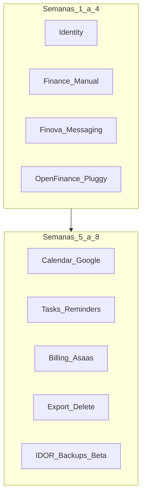
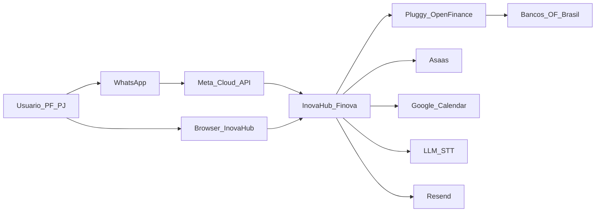
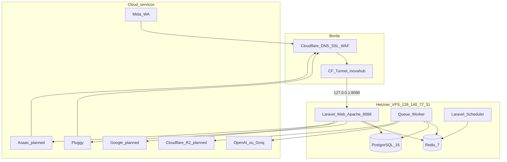
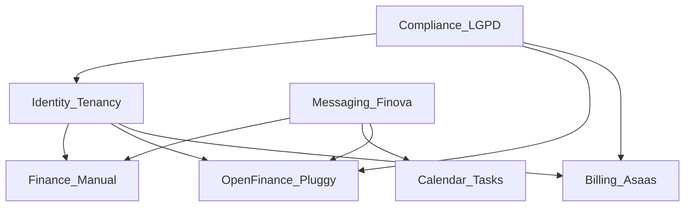
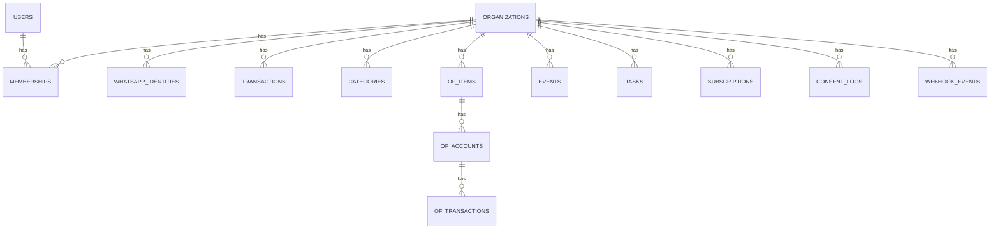
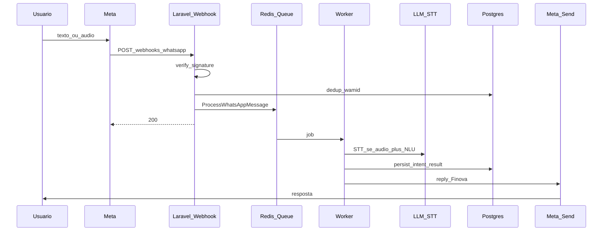
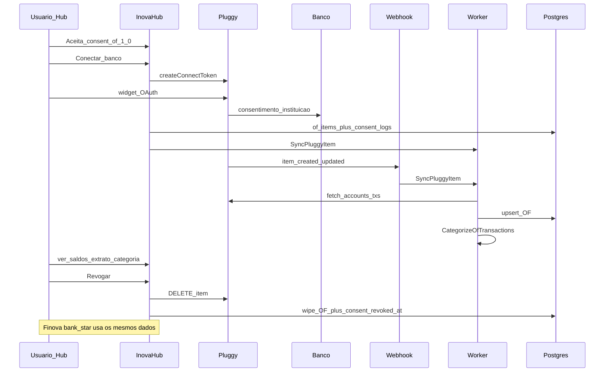
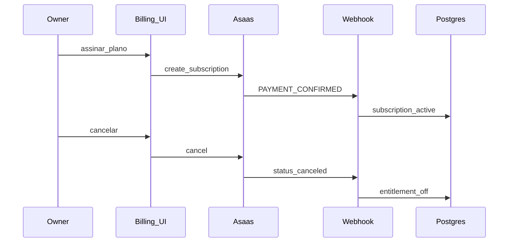

# 20 — System Design completo — Inova Hub / Finova

**Versão:** 1.2  
**Data:** 26/07/2026  
**Status:** Baseline pós-Semana 4 (Open Finance live) + roadmap MVP D29–D56  
**Domínio:** `inovahub.inovatitech.com.br` · API `api-inovahub.inovatitech.com.br`  
**VPS:** `128.140.77.31` (Hetzner) · DNS/SSL: Cloudflare · Origem: **Tunnel `inovahub` → `127.0.0.1:8088`**

Documentos relacionados: [PRD](09-inova-hub-prd.md) · [Arquitetura](10-architecture.md) · [Segurança L1–L11](21-security-layers.md) · [UI responsiva](22-responsive-ui.md) · [DB multi-tenant](23-multitenant-database.md) · [Regras BR-xxx](business-rules/README.md) · [Dia a dia](15-day-by-day-mvp.md) · [Estado vivo](25-project-state.md) · [Termos OF](32-open-finance-terms.md) · [QA Semana 4](33-week4-open-finance-qa.md)

**Changelog 1.1 → 1.2:** Tunnel como origem oficial; Blade confirmado; Horizon = próximo/opcional; OF real (consent `of-1.0`, categorize, revoke); `webhook_events` + `consent_logs`; seção As-is vs To-be; API/jobs/intents marcados live vs planned.

---

## 1. Contexto e objetivos

### 1.1 Problema

Pessoas e pequenas equipes precisam organizar **dinheiro, agenda e tarefas** sem planilha e sem app nativo. O canal natural é o WhatsApp; o painel web serve para análise, conexões bancárias e administração.

### 1.2 Solução

| Camada | Nome | Função |
|--------|------|--------|
| Assistente conversacional | **Finova** | WhatsApp (texto/áudio): lançar, consultar, agendar, tarefas, saldo/extrato |
| Plataforma | **Inova Hub** | Auth, dashboard, OF Connect, Google, billing Asaas, membros, LGPD |

### 1.3 Objetivos de design

1. **UI 100% responsiva** (landing + Hub) — ver [22-responsive-ui.md](22-responsive-ui.md)  
2. **Banco multi-tenant** (`organization_id` + RLS) — ver [23-multitenant-database.md](23-multitenant-database.md)  
3. **Segurança em 11 camadas** (borda → ops) — ver [21-security-layers.md](21-security-layers.md)  
4. Event-driven para webhooks (Meta, Pluggy, Asaas)  
5. Open Finance somente leitura via Pluggy  
6. Billing self-service (Asaas) — cancel/export/delete  
7. Spec/TDD/EDD + CodeRabbit + squads A/B  

### 1.4 Fora do MVP (system design reserva slots)

- Stripe, Drive semântico completo, Meet/atas, B2B RH, verticais, iniciador de pagamento Pix  

### 1.5 As-is vs To-be (pós D28)

Agentes **não** devem tratar itens “planned” como implementados. Estado operacional vivo: [25-project-state.md](25-project-state.md).

| Bounded context | Status | Evidência / próximo |
|-----------------|--------|---------------------|
| Identity / Tenancy | **Live** | orgs, memberships, Sanctum, `SetTenantContext`, Global Scope |
| Messaging / Finova | **Live (parcial)** | webhook WA, OTP, NLU tx + `bank.*`, STT; agenda/tarefa = D29+ |
| Finance manual | **Live** | `transactions` / `categories`, Hub UI + Finova |
| Open Finance | **Live** | Pluggy, connect, sync, Hub, categorize, revoke, `consent_logs` / `of-1.0` |
| Calendar / Tasks | **Parcial** | OAuth Google Hub D29 (`oauth_tokens`); sync/UI = D30+ |
| Billing Asaas | **Planned** | D36+ |
| Compliance LGPD | **Parcial** | Consent OF + revoke; export/delete conta = D36+ |

---

## 2. Visão de alto nível (C4 — contexto)

Asaas, Google Calendar e R2 aparecem no C4 como **slots do MVP**; só Pluggy + Meta (+ LLM/STT) estão ligados em produção hoje.

---

## 3. Contêineres (C4)

**Importante:** 80/443 da VPS já são usados por outros projetos. O Hub **não** publica nessas portas — só escuta em `127.0.0.1:8088` atrás do Tunnel.

### 3.1 Responsabilidades

| Contêiner | Responsabilidade | Status |
|-----------|------------------|--------|
| Laravel Web | HTTP Hub (Blade), API, webhooks (validar + enqueue) | Live |
| Queue Worker | Jobs: NLU, STT, sync OF, categorize; lembretes/exports depois | Live (`worker`; Horizon opcional depois) |
| Scheduler | Sync OF periódico (`pluggy:sync-items`), lembretes, limpeza | Parcial |
| PostgreSQL 16 | Fonte da verdade multi-tenant + RLS | Live |
| Redis 7 | Filas, cache, sessões | Live |
| Cloudflare | DNS, TLS, WAF, Tunnel `inovahub` | Live |
| R2 | Object storage (exports/mídia) | Planned |

---

## 4. Stack tecnológica (decisões fechadas)

| Camada | Escolha | Notas |
|--------|---------|-------|
| Runtime | PHP 8.4 + Laravel 13 | Código em `app/` |
| DB | **PostgreSQL 16** | UUID, JSONB, tenant + RLS |
| Fila/cache | Redis 7 + **queue worker** | Horizon = próximo/opcional até carga/ops |
| Auth | Sanctum + sessão Hub + OTP WhatsApp | |
| Frontend MVP | **Blade** (layouts Hub) | SPA/Inertia = pós-MVP se necessário |
| WA | Meta Cloud API | Finova |
| OF | **Pluggy** | Somente leitura (BR-005) |
| Billing | **Asaas** | Stripe = P1 |
| Agenda | Google Calendar OAuth | Escopos mínimos — D29+ |
| IA | LLM + Whisper | NLU + áudio |
| E-mail | Resend | |
| Deploy | Docker Compose na VPS | `docker-compose.prod.yml` + `.env.prod` |
| Edge | Cloudflare Tunnel | `inovahub` + `api-inovahub` → `127.0.0.1:8088` |

---

## 5. Domínios de negócio (bounded contexts)

| Contexto | Capacidades | Regras | Status |
|----------|-------------|--------|--------|
| Identity / Tenancy | users, orgs, memberships, papéis | BR-001, BR-009 | Live |
| Messaging / Finova | webhook WA, intents, respostas | BR-002, BR-004, BR-010 | Live parcial |
| Finance manual | transactions, categories | BR-003, BR-004 | Live |
| Open Finance | connect, accounts, cards, sync, revoke, consent | BR-005, BR-006 | Live |
| Calendar / Tasks | events, reminders, tasks | — | Planned |
| Billing | trial, subscribe, cancel | BR-007 | Planned |
| Compliance | export, delete, consent | BR-006, BR-008 | Parcial |

---

## 6. Modelo de dados (lógico)

### 6.1 Entidades principais

### 6.2 Tabelas (MVP)

| Tabela | Campos-chave | Status |
|--------|----------------|--------|
| `organizations` | id (uuid), name, timezone, locale, currency | Live |
| `users` | id, email, password | Live |
| `memberships` | org_id, user_id, role (`owner`/`member`/`viewer`) | Live |
| `whatsapp_identities` | org_id, user_id, phone_e164, verified_at | Live |
| `categories` | org_id, name, kind | Live |
| `transactions` | org_id, amount_cents, type, category_id, source, occurred_at | Live |
| `of_items` | org_id, pluggy_item_id, status, consent_at, **consent_version**, **consent_revoked_at** | Live |
| `of_accounts` | of_item_id, pluggy_account_id, balance_cents, type, name | Live |
| `of_transactions` | of_account_id, amount_cents, description, category_suggested, **category_manual**, occurred_at | Live |
| `consent_logs` | org_id, user_id, type, version, accepted_at, meta | Live (OF) |
| `webhook_events` | source, external_id, status, processed_at, last_error | Live (dedup BR-010) |
| `events` / `reminders` | agenda Google | Planned |
| `tasks` / `projects` | tarefas | Planned |
| `oauth_tokens` | org_id, provider, encrypted tokens, consent_version | Live (Google D29) |
| `subscriptions` | org_id, asaas_id, plan, status | Planned |
| `audit_logs` | org_id, actor_id, action, meta jsonb | Planned |

**Convenção:** toda query de negócio filtra `organization_id` (BR-001).  
**Detalhe completo multi-tenant + RLS:** [23-multitenant-database.md](23-multitenant-database.md).

---

## 6.1 Frontend responsivo (obrigatório)

Landing e painel Inova Hub são **100% responsivos** (mobile-first).  
Breakpoints, componentes, DoD de viewport e anti-padrões: [22-responsive-ui.md](22-responsive-ui.md).

Implementação atual: Blade + CSS mobile-first em `layouts/hub` (shell estreito → amplo em ≥768px).

Requisitos resumidos:

- Viewport meta correto; sem overflow-x de layout  
- Tabelas → cards no mobile  
- Nav: drawer/bottom no mobile; sidebar no desktop (evoluir no onboarding D34)  
- Touch targets ≥ 44px; formulários 1 coluna no mobile  
- Testar 360 / 768 / 1280 antes do merge de UI  

---

## 7. Arquitetura de eventos (EDD)

### 7.1 Princípio

Controllers de webhook: **validar assinatura → dedup (`webhook_events`) → dispatch Job → 200 rápido**.  
Lógica de negócio nos Jobs/Handlers.

### 7.2 Fluxo mensagem WhatsApp

### 7.3 Fluxo Open Finance (Pluggy) — as-is

Detalhe legal: [32-open-finance-terms.md](32-open-finance-terms.md).

### 7.4 Fluxo billing (Asaas) — planned

### 7.5 Catálogo de jobs (MVP)

| Job | Trigger | Efeito | Status |
|-----|---------|--------|--------|
| `ProcessWhatsAppMessage` | webhook Meta | NLU + side-effects + reply | Live |
| STT (inline / job) | mídia WA | Whisper → texto | Live |
| `SyncPluggyItem` | webhook / Hub / `pluggy:sync-items` | contas + txs | Live |
| `CategorizeOfTransactions` | pós-sync OF | categoria sugerida (heurística) | Live |
| `SendReminder` | scheduler | mensagem WA | Planned |
| `ExportOrgData` | user request | ZIP/CSV | Planned |
| `DeleteOrganization` | user confirm | cascade + revoke | Planned |
| `ProcessAsaasWebhook` | Asaas | entitlement | Planned |

---

## 8. API e superfícies HTTP

### 8.1 Hosts

| Host | Uso |
|------|-----|
| `https://inovahub.inovatitech.com.br` | Painel Hub (Blade) + legal |
| `https://api-inovahub.inovatitech.com.br` | API + webhooks (mesmo Tunnel / app) |

### 8.2 Webhooks (ingress)

| Método | Path | Auth | Status |
|--------|------|------|--------|
| GET/POST | `/webhooks/whatsapp` | Meta verify + signature | Live |
| GET/POST | `/webhooks/pluggy` | secret/header Pluggy (GET = ping health) | Live |
| POST | `/webhooks/asaas` | token Asaas | Planned |

### 8.3 Superfícies Hub e API

**Implementado (as-is)**

| Área | Exemplos |
|------|----------|
| Auth Hub | `/register`, `/login`, `/logout` (sessão) |
| Hub | `/hub`, `/hub/transactions`, `/hub/connections`, `/hub/whatsapp` |
| Legal | `/legal/open-finance`, `/legal/privacy` |
| OF Hub | connect-token, items, sync, revoke, extrato, categoria |
| API | `POST /api/v1/open-finance/connect-token` (Sanctum + tenant) |
| Webhooks | WhatsApp, Pluggy |

**Planejado (to-be)**

| Área | Exemplos |
|------|----------|
| Calendar | `GET/POST /events`, `POST /google/connect` |
| Tasks | `GET/POST /tasks` |
| Members | `GET/POST /members` |
| Billing | `GET /billing`, subscribe/cancel |
| LGPD | `POST /exports`, `DELETE /account` |
| OF API | `GET /open-finance/accounts`, `DELETE /open-finance/items/{id}` (hoje revoke é Hub) |

Contrato OpenAPI formal: gerar conforme implementação. Inventário vivo: [05-api-surface.md](05-api-surface.md).

### 8.4 Finova — intents (contrato conversacional)

| Intent | Entrada | Saída | Status |
|--------|---------|-------|--------|
| `tx.create` / `tx.income` | NL | lançamento (+ confirmação se low confidence) | Live |
| `tx.query` | período/categoria | resumo | Live |
| `bank.balance` / `bank.statement` / `bank.cards` | OF conectado | saldos/extrato/cartões | Live |
| `event.create` / `event.query` | NL | agenda | Planned |
| `task.create` | NL | tarefa | Planned |
| `help` / `support` | — | menu / handoff | Parcial |

---

## 9. Segurança

**Documento canônico das camadas L1–L11:** [21-security-layers.md](21-security-layers.md).

### 9.1 Resumo das camadas

| Camada | Foco |
|--------|------|
| L1 | Cloudflare WAF / TLS / DDoS |
| L2 | Firewall VPS / SSH / Docker |
| L3 | HTTPS, cookies Secure/HttpOnly |
| L4 | CSRF, XSS, validação, headers, rate limit |
| L5 | AuthN/AuthZ, papéis, OTP |
| L6 | Multi-tenant app (scopes/policies) |
| L7 | Postgres crypto, backups, **RLS** |
| L8 | Webhooks assinados + idempotência |
| L9 | Pluggy/Asaas/Google/LLM least privilege |
| L10 | LGPD export/delete/consent/audit |
| L11 | Secrets, CI, monitoramento, incidentes |

### 9.2 Controles críticos MVP

| Controle | Design |
|----------|--------|
| Tenant isolation | Scope + policy + RLS + testes IDOR (BR-001; OF: `OfTenantIsolationTest`) |
| Webhook auth | Assinaturas/secrets; rejeitar inválidos |
| Idempotência | `webhook_events` (BR-010) |
| Secrets | `.env` / `.env.prod` na VPS; nunca no git |
| Tokens OAuth | Encrypted at rest (quando Google/Asaas) |
| Admin interno | **Não** expor na internet pública |
| Rate limit | Por IP e por `phone_e164` |
| LGPD | Consent OF versionado; export/delete (BR-008) planned |
| Prompt injection | Tools allowlist; sem SQL livre da LLM |

### 9.3 Dados sensíveis

- Não logar corpo completo de mensagens em produção (PII)  
- Áudio: processar e descartar (retenção mínima)  
- OF: nunca senha bancária; só tokens Pluggy  

### 9.4 Comunicação

- TLS na borda (Cloudflare + Tunnel)  
- **Não** comercializar como “E2E” genérico: distinguir trânsito vs processamento IA  

---

## 10. Infraestrutura e deploy

### 10.1 Topologia produção (travada)

| Item | Valor |
|------|-------|
| DNS | Cloudflare zona `inovatitech.com.br` |
| Origem | **Cloudflare Tunnel** nome `inovahub` → `http://127.0.0.1:8088` |
| Hosts | `inovahub` + `api-inovahub` (não usar `api.inovahub` — Universal SSL Free) |
| VPS | `128.140.77.31`, path `/opt/inovahub`, user típico `gestaoti` |
| Compose | `docker compose -f docker-compose.prod.yml --env-file .env.prod` |
| Serviços | `app`, `worker`, `postgres`, `redis` (+ scheduler quando endurecer) |
| Portas VPS | App só `127.0.0.1:8088`; 80/443 de outros projetos |
| Local | App `127.0.0.1:8092`, Postgres `5442`, Redis `6392` |

Guia PuTTY: [24-deploy-vps-putty.md](24-deploy-vps-putty.md).

### 10.2 Ambientes

| Env | Uso |
|-----|-----|
| local | Docker Desktop (portas 8092/5442/6392) |
| staging | subdomínio opcional na mesma VPS ou segunda |
| production | hosts acima |

### 10.3 CI/CD

- GitHub Actions: Composer + Pest + Pint (`.github/workflows/ci.yml`)  
- CodeRabbit em PRs (`.coderabbit.yaml`)  
- Deploy: SSH/PuTTY + `git pull` + compose build/up (pipeline a endurecer na semana 8)  
- Remotes: `origin` = GitHub, `gitlab` = GitLab  

### 10.4 Backups

- Snapshot Hetzner semanal  
- `pg_dump` diário + restore drill (D47)  

---

## 11. Qualidade e engenharia

| Prática | Como |
|---------|------|
| SDD | Spec Kit / Dxx antes de feature |
| TDD | Pest Red→Green para BR-xxx |
| EDD | Webhooks → Jobs |
| CodeRabbit | Review automático |
| Squad A | Build / teste / validação |
| Squad B | Pós-launch / suporte / SRE |

Definition of Done: ver [18-agent-squads.md](18-agent-squads.md).

---

## 12. NFRs (não funcionais)

| NFR | Alvo MVP |
|-----|----------|
| Disponibilidade | 99,5% |
| Latência Finova texto | p95 &lt; 8s |
| Latência webhook ack | &lt; 2s |
| UI responsiva | 100% landing+Hub; DoD viewport [22](22-responsive-ui.md) |
| Multi-tenant | 0 IDOR; RLS FORCE em tabelas de negócio |
| Segurança | Camadas L1–L11 aplicáveis [21](21-security-layers.md) |
| RPO backup | ≤ 24h |
| RTO | ≤ 4h (runbook) |

---

## 13. Evolução (fases)

| Fase | Escopo | Notas |
|------|--------|-------|
| A.1 Semanas 1–4 | Contas, Hub, Finova tx/áudio, **Pluggy OF completo** | **Fechada** (D28) |
| A.2 Semanas 5–6 | Google Calendar, tasks, lembretes, Asaas, LGPD export/delete | D29–D42 |
| A.3 Semanas 7–8 | Conta compartilhada, IDOR suite, backups, beta | D43–D56 |
| B | Portal RH, bulk WhatsApp, agregados | Pós-MVP |
| C | Verticais (packs intents/categorias) | Pós-MVP |
| P1 | R2/Drive, Stripe, Meet/atas, MFA, Horizon se necessário | Pós-MVP |

Adapters: `OpenFinanceProvider` (**live**), `BillingGateway`, `LlmClient`, `WhatsAppClient` (conforme implementação).

---

## 14. Riscos de arquitetura

| Risco | Mitigação |
|-------|-----------|
| Meta/Pluggy KYC atrasam | Sandbox + feature flags; produção após KYC |
| Custo LLM | Heurística NLU primeiro; confirmação; limites |
| Vazamento multi-tenant | Testes IDOR obrigatórios (OF já coberto) |
| Docker port clash local | Portas 8092/5442/6392 |
| Claims de segurança | Copy honesto TLS ≠ E2E |
| Drift doc ↔ código | Atualizar este arquivo + [25](25-project-state.md) a cada marco |

---

## 15. Checklist de aceite do System Design

- [x] Contexto e C4 definidos  
- [x] Stack e hosts fechados (Tunnel + Blade)  
- [x] Modelo de dados multi-tenant + RLS  
- [x] As-is vs To-be pós-Semana 4  
- [x] UI 100% responsiva especificada  
- [x] Segurança L1–L11 documentada  
- [x] Fluxos EDD WA / Pluggy (as-is) / Asaas (planned)  
- [x] Superfícies API + intents Finova (live vs planned)  
- [x] Deploy Cloudflare Tunnel + Hetzner  
- [x] Ligação a BR-xxx, PRD e roadmap D01–D56  

**Próximo artefato de engenharia:** Spec/implementação D29 (Google OAuth) sem redesenhar este C4; OpenAPI `/v1` incremental conforme endpoints saírem do “planned”.
