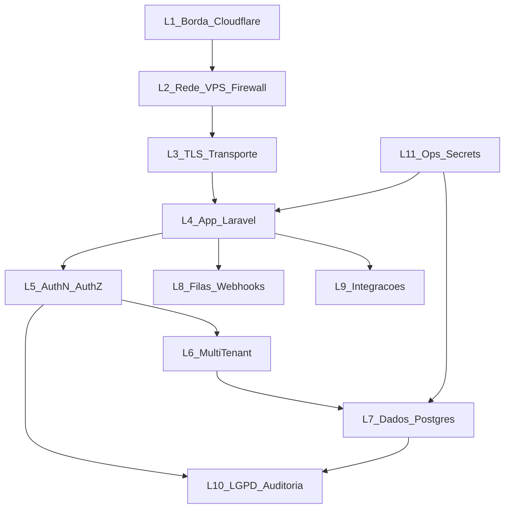

# 21 — Camadas de segurança (obrigatórias)

**Status:** mandatório em todo o Inova Hub / Finova  
**Referência:** [20-system-design.md](20-system-design.md) §9 · BR-001 · OWASP ASVS / API Top 10  

Nenhuma feature entra em produção sem as camadas aplicáveis abaixo.

---

## Visão em camadas



---

## L1 — Borda (Cloudflare)

| Controle | Requisito |
|----------|-----------|
| DNS proxied | A records `inovahub` e `api.inovahub` com proxy laranja |
| TLS | Full (strict) |
| WAF | Regras gerenciadas + rate limit básico na borda |
| DDoS | Proteção Cloudflare ativa |
| Headers | HSTS via Cloudflare / app |
| Bot fight | Ativar para landing; API com allowlist de paths de webhook |

---

## L2 — Rede / VPS

| Controle | Requisito |
|----------|-----------|
| Firewall | Só 22 (SSH key-only), 80, 443 |
| SSH | Sem senha; fail2ban ou equivalente |
| Admin | Painel admin **não** publicado na internet |
| Docker | Rede interna; Postgres/Redis **não** expor 0.0.0.0 em produção |
| Separação | App e workers sem privileged desnecessário |

---

## L3 — Transporte

| Controle | Requisito |
|----------|-----------|
| HTTPS | Obrigatório em staging/prod |
| TLS 1.2+ | Preferir 1.3 |
| Cookies | `Secure`, `HttpOnly`, `SameSite=Lax` (ou Strict onde couber) |
| Comunicação interna | Preferir rede Docker; sem credenciais em querystring |

**Copy:** não vender “E2E” como sinônimo de TLS.

---

## L4 — Aplicação (Laravel)

| Controle | Requisito |
|----------|-----------|
| CSRF | Ativo em rotas web de sessão |
| XSS | Escape Blade; CSP básica |
| Mass assignment | `$fillable` / DTOs explícitos |
| Validação | Form Requests em toda entrada |
| Rate limit | Login, OTP, API, webhooks |
| Security headers | `X-Frame-Options`, `X-Content-Type-Options`, `Referrer-Policy`, `Permissions-Policy` |
| Upload | Tipo/tamanho allowlist (quando Drive) |
| Erros | Sem stack trace em produção |
| Dependências | CI + auditoria Composer |

---

## L5 — Autenticação e autorização

| Controle | Requisito |
|----------|-----------|
| Senha | Hash bcrypt/argon2; política mínima |
| Sessão | Regeneração no login; timeout |
| OTP WhatsApp | Código curto, TTL, tentativas limitadas |
| Papéis | `owner` / `member` / `viewer` (BR-009) |
| Policies | Toda ação sensível via Policy/Gate |
| MFA | P1 no Hub; obrigatório para staff interno |
| Recovery | Reset só via e-mail Resend com token de uso único |

---

## L6 — Multi-tenant (crítico)

| Controle | Requisito |
|----------|-----------|
| Coluna | `organization_id` (UUID) em **toda** tabela de negócio |
| Resolução | Tenant do membership ativo / vínculo WhatsApp / item Pluggy |
| Scope | Global scope Eloquent + enforce em Query Builder raw |
| Jobs | Job recebe `organization_id`; nunca “adivinhar” |
| IDOR | Testes Pest cross-tenant obrigatórios (BR-001) |
| RLS Postgres | Políticas RLS como **segunda barreira** (ver § DB) |
| Índices | `(organization_id, …)` em consultas frequentes |
| Cache keys | Prefixo `org:{uuid}:` |
| Exports | Só dados do tenant do owner |

---

## L7 — Dados (PostgreSQL)

| Controle | Requisito |
|----------|-----------|
| Criptografia em repouso | Disco VPS cifrado se disponível; volumes protegidos |
| Tokens OAuth | `encrypted` cast / vault |
| Secrets | Nunca na tabela em claro |
| Backup | Dump diário criptografado + restore drill |
| Least privilege | User DB da app sem SUPERUSER; sem DROP em prod app user |
| Migrations | Revisadas; sem `migrate:fresh` em prod |
| PII | Minimização; mascaramento em logs |

### Row Level Security (RLS) — segunda barreira

```sql
-- Padrão (exemplo): ativar por tabela de negócio
ALTER TABLE transactions ENABLE ROW LEVEL SECURITY;
ALTER TABLE transactions FORCE ROW LEVEL SECURITY;
-- Policy usa SET app.current_org = '<uuid>' no início da request
```

Laravel: middleware `SetTenantContext` executa `SET LOCAL app.current_org = ...` em cada request autenticada.  
Workers: mesmo SET no início do Job.

---

## L8 — Filas e webhooks (EDD)

| Controle | Requisito |
|----------|-----------|
| Assinatura Meta | Validar `X-Hub-Signature-256` |
| Pluggy / Asaas | Validar secret/token |
| Idempotência | Tabela `webhook_dedup` (BR-010) |
| Ack rápido | Controllers só enqueue |
| Retry | Jobs com backoff; dead letter / failed_jobs monitorado |
| Payload | Não logar PII completa |

---

## L9 — Integrações

| Controle | Requisito |
|----------|-----------|
| Pluggy | Somente leitura (BR-005); revoke apaga dados (BR-006) |
| Google | Escopos mínimos; consentimento versionado |
| Asaas | Webhook autenticado; cancel self-service (BR-007) |
| LLM | Sem tools de SQL; allowlist de ações |
| Timeouts | HTTP client com timeout/retry limitado |

---

## L10 — LGPD e auditoria

| Controle | Requisito |
|----------|-----------|
| Base legal | Documentada por finalidade |
| Consent OF | `consent_logs` + versão |
| Export | CSV/ZIP no Hub (BR-008) |
| Delete | Cascade + revoke terceiros |
| Audit | `audit_logs` para billing, OF, membros, delete |
| Retenção | Mensagens/áudio: mínima necessária |

---

## L11 — Ops e secrets

| Controle | Requisito |
|----------|-----------|
| `.env` | Fora do git; permissões 600 na VPS |
| Rotação | Tokens Meta/Pluggy/Asaas rotacionáveis |
| CI secrets | GitHub Secrets apenas |
| CodeRabbit | Blockers de segurança bloqueiam merge |
| Monitoramento | Health `/up`; alertas; Sentry opcional |
| Incidentes | Runbook Squad B `/incidente` |

---

## Checklist de PR (segurança)

- [ ] Tenant filter / policy / teste IDOR se toca dados  
- [ ] Validação de entrada  
- [ ] Sem secret no diff  
- [ ] Webhook com assinatura + dedup (se aplicável)  
- [ ] Headers/cookies ok em rotas web  
- [ ] Log sem PII sensível  
- [ ] BR-xxx atualizado se regra mudou  

## Testes mínimos de segurança

| Suite | O que cobre |
|-------|-------------|
| `TenantIsolationTest` | Cross-org 403/404 |
| `WebhookSignatureTest` | Assinatura inválida rejeitada |
| `WebhookIdempotencyTest` | Reentrega não duplica |
| `RolePolicyTest` | viewer não cancela billing |
| `AuthRateLimitTest` | brute force login/OTP |
