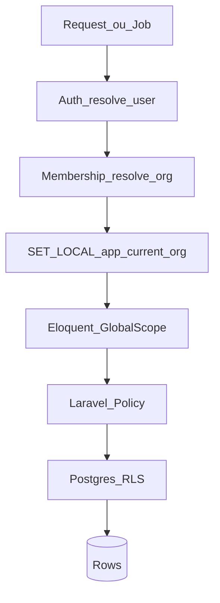

# 23 — Banco de dados multi-tenant

**SGBD:** PostgreSQL 16  
**Estratégia MVP:** **shared database + shared schema + `organization_id`** + **RLS** como segunda barreira.

---

## Por que este modelo

| Modelo | Uso neste projeto |
|--------|-------------------|
| DB por cliente | Não no MVP (ops pesada) |
| Schema por cliente | Possível no futuro B2B enterprise |
| **Shared + `organization_id` + RLS** | **Escolhido** — escala B2C/B2B leve |

---

## Regras estruturais

1. Toda tabela de negócio tem `organization_id UUID NOT NULL` (FK → `organizations`).  
2. PK preferencialmente UUID.  
3. Índices começam por `organization_id` quando a query é por tenant.  
4. Unique constraints são **por tenant** (ex.: `UNIQUE(organization_id, phone_e164)`).  
5. Soft deletes, se usados, também scoped por org.  
6. Tabelas globais sem tenant: só catálogos de sistema (ex.: `plans` Asaas) — documentar explicitamente.

---

## Camadas de isolamento



| Camada | Onde | Falha = |
|--------|------|---------|
| Membership | App | 403 |
| Global Scope | Eloquent | query sem org |
| Policy | AuthZ | ação negada |
| RLS | Postgres | zero rows / error |

---

## Padrão de migration

```php
// Exemplo conceitual
$table->uuid('id')->primary();
$table->foreignUuid('organization_id')->constrained()->cascadeOnDelete();
$table->timestamps();
$table->index('organization_id');
```

## Padrão de model

- Trait `BelongsToOrganization`  
- Global scope `OrganizationScope`  
- Boot: preenche `organization_id` do contexto atual  

## Padrão de Job / webhook

1. Resolver `organization_id` pelo telefone / pluggy_item / asaas_customer  
2. `TenantContext::set($orgId)`  
3. `SET LOCAL app.current_org`  
4. Executar lógica  

## RLS (SQL)

```sql
CREATE POLICY tenant_isolation ON transactions
  FOR ALL
  USING (organization_id = current_setting('app.current_org', true)::uuid)
  WITH CHECK (organization_id = current_setting('app.current_org', true)::uuid);
```

Aplicar em: `transactions`, `categories`, `events`, `tasks`, `of_*`, `memberships` (leitura), `subscriptions`, `oauth_tokens`, `consent_logs`, `audit_logs`.

Webhooks sem usuário: connection DB com role que **SET** org antes do sync; ou role bypass só para migration user.

---

## Testes obrigatórios

| Teste | Assert |
|-------|--------|
| User A não lê transaction de B | 404/403 |
| Job org A não grava em B | falha / scope |
| Export owner A sem dados B | CSV limpo |
| RLS sem `app.current_org` | 0 rows (FORCE RLS) |

Ver BR-001.

---

## Anti-padrões

- Query raw sem `organization_id`  
- `Model::all()` em tabela tenant  
- Cache global com dados de org  
- Shared queue payload sem org_id  
- Admin query sem audit trail  
